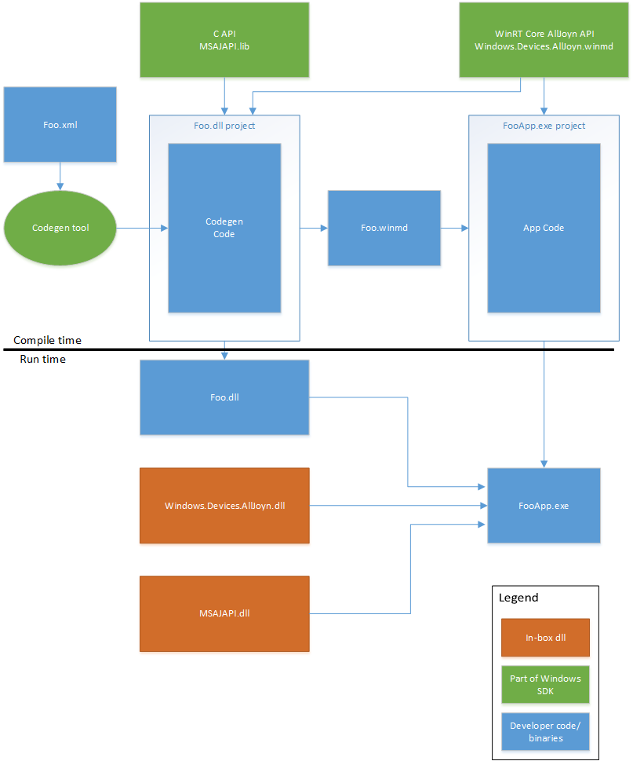

> [!NOTE]
> You are viewing archived documentation. AllJoyn is no longer supported by Windows 10 IoT. For questions, please open an issue on GitHub or leave us feedback in the comments below.

# AllJoynCodeGen Overview

We've created a code generation tool, AllJoynCodeGen, that generates a complete Windows Runtime component using an XML description of one or more AllJoyn interfaces derived from a specification or device.

The Windows Runtime component generated by this tool can be consumed in any supported language (JS, C#, C++/CX, etc.) using APIs that are available in the Universal Windows SDK. This means that the same component can be used on any platform that has the AllJoyn OneCore package (router service and C API dll.) A developer can then use the component to create a producer and/or a consumer of that interface. 

**Note**  For more details about the AllJoyn C APIs, you can download the AllJoyn Core SDK and documentation at [The AllSeen Alliance](http://go.microsoft.com/fwlink/?LinkId=524584).

## How does AllJoynCodeGen work?

The basic flow is as follows:

1. An XML file authored in the AllJoyn XML (currently DBus introspection format) that describes the service is fed into the codegen tool.
2. The AllJoynCodeGen tool generates code that results in a Windows Runtime component. This generated code relies on **MSAJAPI.lib** and [Windows.Devices.AllJoyn](https://msdn.microsoft.com/library/windows/apps/xaml/windows.devices.alljoyn.aspx) from the Windows 10 SDK.
3. The developer builds an application that consumes this component.
4. At runtime, the developer's application will load the Windows Runtime component generated by the tool (e.g.: foo.dll,) as well as the in-box DLLs **MSAJAPI.dll** and **Windows.Devices.AllJoyn.dll**.

The following workflow diagram illustrates this process:

## Running from the command line

The AllJoynCodeGen tool currently exists as a command line tool shipped with the Windows 10 SDK. To run the tool pass a valid XML file using the following string:

	AllJoynCodeGen –i Foo.xml –o c:\users\developer1\documents\Foo\

## Reviewing the output

The generated classes wrap functionality exposed by the Core C API. Because the generated code is an abstraction, this is not a 1-to-1 mapping. The table below shows which Core C++ APIs are wrapped by each generated code class. The following placeholders are used for generated names in the table:

* `<Foo>` is the name of the interface defined in the xml file
* `<Signal>` is the name of a signal, taken from the xml file
* `<Method>` is the name of a method, taken from the xml file
* `<Property>` is the name of a property, taken from the xml file

> | Windows Runtime Class |  | Description | Core C++ API |
> | ------------------------ | --- | --------- | ---------- |
> | `<Foo>`Watcher |  | Searches for producers that advertise the target service | *BusListener* class; *BusAttachment* class |
> | `<Foo>`JoinSessionResult |  | Reports the success or failure of joining a session, and exposes a `<Foo>Consumer` instance for the session if the join was successful. | *JoinSessionAsyncCB* class; *QStatus* |
> | `<Foo>`Producer |  | Advertises a service and exposes handlers for AllJoyn events. | *BusObject* class; *BusAttachment* class; *InterfaceDescription* class; *SessionPortListener* class; *Message* class |
> | `<Foo>`Signals |  | Exposes methods and handlers to send and receive signals. Used by both producers and consumers. | *BusObject* class; *InterfaceDescription* class; *Message* class |
> | `<Foo>`Consumer |  | Interacts with a service after it has been discovered. | *ProxyBusObject* class; *InterfaceDescription* class; *SessionListener* class; *Message* class |
> | `<Foo>``<Method>`CalledEventArgs |  | Arguments passed to methods in `EventAdapters.<Foo>ServiceEventAdapter`. | *Message* class |
> | `<Foo>``<Method>`Result |  | Used by method implementations in I<Foo>Service to report the success or failure of the call, as well as any return values. | *Message* class; *QStatus* |
> | `<Foo>``<Signal>`ReceivedEventArgs |  | Arguments passed to a signal in <Foo>Signals. | *Message* class |

## Build guide

#### Creating the component

The generated code needs to be contained in a component that shares the same interface name as the XML. For example, if the XML for a toaster is defined as com.microsoft.sample.toaster, we would create a runtime component com.microsoft.sample. 

Alternatively, you can name the component whatever you want (e.g. fooCodeGenComponent), but you must manually update the root namespace under the Project properties to be the same as the interface name.

> [!TIP]
> You can find the root namespace in the pch.h file that is generated from the AllJoynCodeGen tool.
