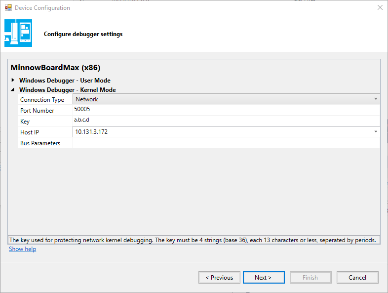
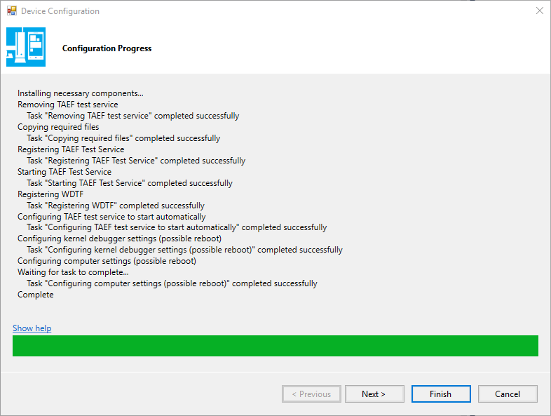
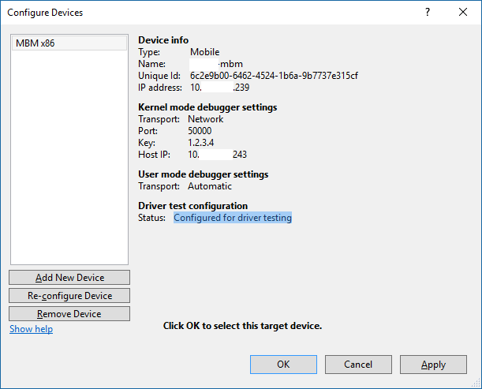
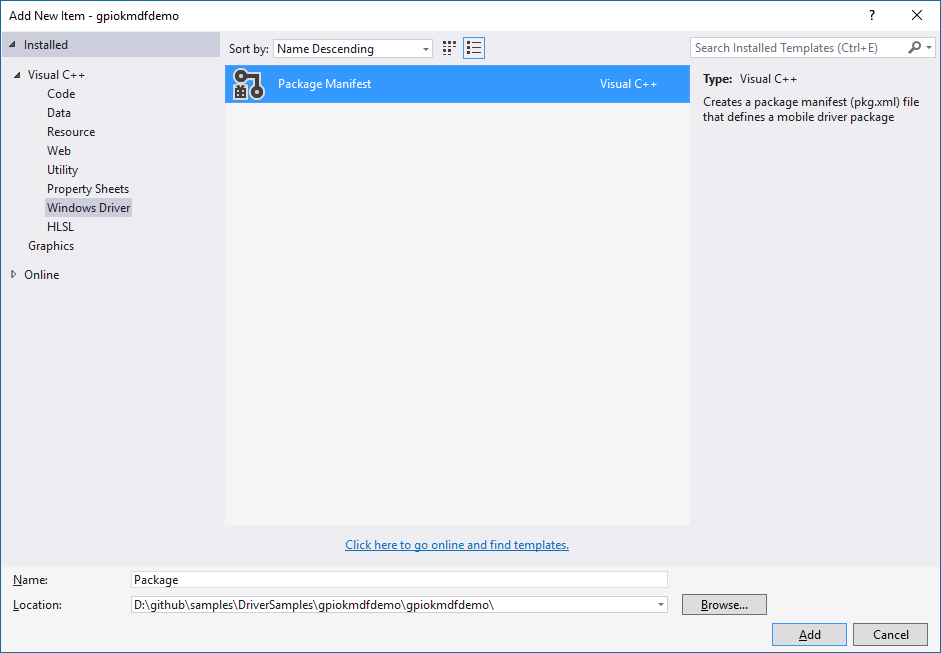
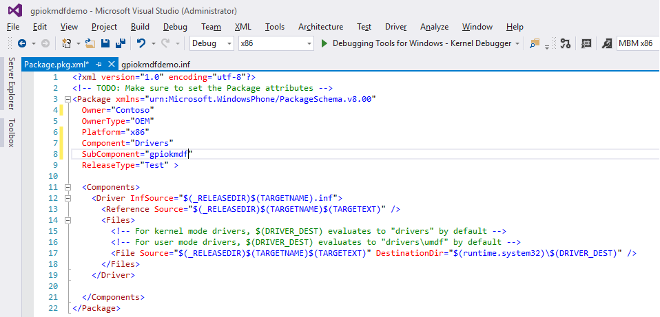
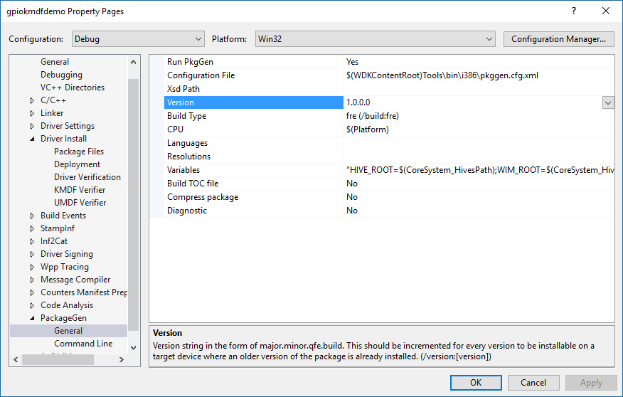
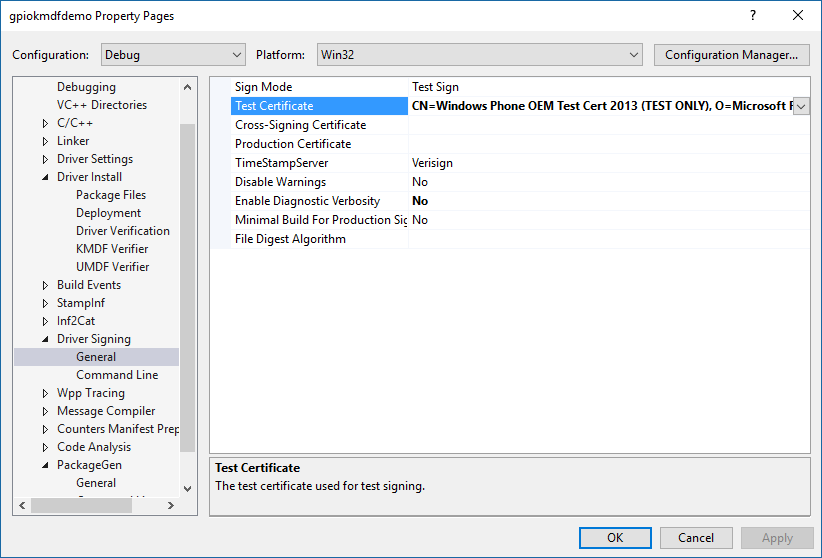
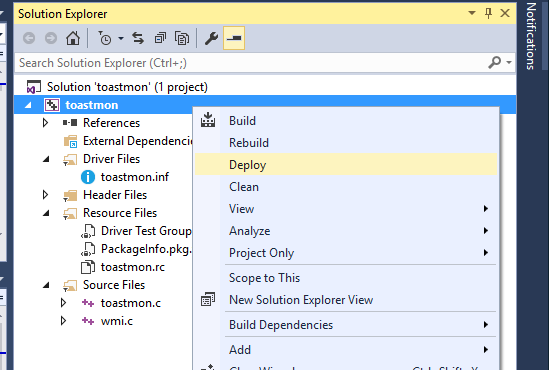

# Driver deployment

Deploy a driver on Windows 10 IoT Core with Visual Studio. 

Configure your Visual Studio driver project so that you can compile and deploy a driver for a specific platform during driver development phase. 

For this exercise you can use the [gpiokmdfdemo sample driver](https://github.com/ms-iot/samples/tree/develop/DriverSamples).

If you're looking to add a driver to an image, please visit the instructions in our [IoT Manufacturing Guide](https://docs.microsoft.com/en-us/windows-hardware/manufacture/iot/add-a-driver-to-an-image).

## Step 1 : Setup 
___

### On the device

* Make sure that your device has an IoTCore image installed by following the [Get Started instructions](https://developer.microsoft.com/en-us/windows/iot/getstarted).
* Connect to your device via [Powershell](../connect-your-device/PowerShell.md).

### On the PC

* Make sure you have installed Visual Studio 2017.
* Install the [Windows Driver Kit](https://msdn.microsoft.com/windows/hardware/dn913721(v=vs.8.5).aspx).  You will need to install the SDK and WDK.
* Install the certificates so that the driver is signed correctly and can run on your device. From an elevated command prompt execute the commands listed below:

    1.  `cd c:\Program Files (x86)\Windows Kits\10\Tools\bin\i386` 
    2.  `set WPDKContentRoot=c:\Program Files (x86)\Windows Kits\10`
    3.  `InstallOEMCerts.cmd`
  
* Apply fix to enable F5 deployment from VS. In the elevated command prompt, execute the following commands:

    1.  `cd %TEMP%` ( will change directory to `c:\users\<usernsme>\Appdata\Local\Temp`)
    2.  `md “WdkTempFiles”` Manually create a “WdkTempFiles” directory 
    This is a workaround for a bug in the tooling and requires to be done *only once* in the PC.


## Step 2 : Provision device with Visual Studio 
___
* Open Visual Studio and select **Driver > Test > Configure Devices > Add New Device**
    * If the Driver Menu option is not shown, check if SDK is installed.

* In the **Device Configuration** dialog, 
    * Enter a user friendly Display Name for your target device
    * Select Device Type = Mobile
    * In the list displayed, sort by IP address, and find the address for the IoT device and select. If there are two entries, select the one with the non-zero GUID.  Make sure the row is selected – it should highlight blue
    * At the bottom of the dialog are two radio buttons.  Select the one which says **Provision device and choose debugger settings**.  Select **Next**

* On the **Configure debugger settings**, set the appropriate settings.  Note the following:
   * The MinnowBoardMax can use the network for debugging.
       * Use connection type **Network**
       * Select some port – default can be used
       * Select some key – default can be used
       * Select the host IP of the machine running visual studio.  Do not use the autonet (169.xxx) address.
       * Select **Next**
       
       
       
    * The Raspberry Pi uses serial for kernel debugging.
       *  Connect the appropriate serial debugging cable to the PI and the host machine
       *  Select **Serial** for the connection type
       *  Fill out the rest of the parameters as appropriate for the Raspberry Pi.
       *  Select **Next**

* The WDK, through VS, will now provision the IoT device.  TAEF and WDTF will be installed on the device, and the device will be set up for kernel debugging per the settings provided above.

* When complete, the device may reboot.  The progress screen on the **Device Configuration** will provide status, and shows complete when the IoT device has completed the installation. Press **Finish**.



* The device is now provisioned and the **Device test configuration** status shows **Configured for driver testing**



## Step 3 : Configure Visual Studio driver project
___    
1. Launch Visual Studio in the administrator mode and open the visual studio driver project.
2. Make sure the Target Platform Version matches the SDK installed on your development machine. Select Project Properties from the Solution Explorer window.  Under General Configuration Properties assure that the Target Platform Version matches the SDK installed on your development computer.  You can check the version of the SDK from the **Control Panel > Programs > Programs and Features**.
3. Under **Project > Add New Item > Visual C++ > Windows Driver**, select **Package Manifest** and Press **Add**.



 `Package.pkg.xml` file will be added to the project. In this file, specify the Owner, Platform, Component and SubComponent tags. 
 

 
4. Set package version number at **Project Properties > PackageGen > Version**. Note that everytime you need to perform a Install/Reinstall of the driver, this version number has to be incremented.



5. Under **Project Properties > Driver Signing > Test Certificate**, select test certificate (Phone OEM Test Certificate)



6. Go to **Driver Install** and select **Deployment**


* From the **Target Device Name** dropdown, select the target created above in the provisioning process. Notice the two options for **Install / Reinstall** and **Fast Reinstall**. Choose an option and Click **Ok**.
* **Install / Reinstall** is used for the initial installation of a driver to the target.  This installs the driver package using the Windows update stack and can take several minutes. This must be used every time the INF file is changed. 
    
> [!TIP]
> Every time this option is used to install a driver after the initial installation, the package version number must be incremented.

* **Fast Reinstall** can be used once a driver has been installed, and there are no subsequent changes to the drivers INF file which affect the registry.  This method bypasses the install process, shuts down all devnodes associated with the driver, copies the driver over, and restarts the devnode.  This takes a few (<20) seconds.

    
> [!IMPORTANT]
> This method is not guaranteed to succeed – If for some reason a devnode cannot be shutdown to release the driver, the operation will fail.  This can be due to faulty hardware, or an initial faulty implementation of the driver.  The Install/Reinstall option must be used in this case.


Your Visual Studio project is now ready to build and deploy a driver to your target device. If you are using the sample gpiokmdfdemo driver you need to generate ACPI table and copy to your target device, then follow the steps in [building the driver in Visual Studio](https://developer.microsoft.com/en-us/windows/iot/samples/driverlab2).


## Step 4 : Build and deploy driver
___
This can be done in two ways, using the **F5** key and using the **Deploy** option. In both ways, the driver will be built and deployed (i.e. installs it on device) and the F5 attaches the Visual Studio kernel debugger to the installed and loaded driver. 

Some users prefer to use the **Deploy** functionality and attach a different kernel debugger, such as WinDBG or KD.  This can provide more flexibility than using the VS debugger.

### Deploy
1.  Right-click on the project in the solution explorer
2.  Select **Deploy**

 

3.  The deployment process should proceed.  The IoT device will be rebooted after deployment, and should show the “Gears” screen while installation is taking place.

Build output is in the **Output** Window
Deployment status is also in the output window
When Installation completes, the device will reboot again, and the VS Output screen will indicate success or failure.

### F5

1.  From the build window, make sure that the configurations are correct – the current build arch is the same as the target device arch.  This is where having the arch in the target name is valuable.  The target will be displayed in the view box on the menu bar in VS on the top-middle-right.
2.  Press **F5**.  The target will be built, deployed, and attached to the VS Kernel Debugger.

* After the reboot, make sure PowerShell is still connected to it, otherwise, re-connect to the target device using the PowerShell `enter-pssession` command..


## Known Issues
___

### Provisioning Errors
A race condition during the interaction with MinnowBoardMax can result in a reported failure during provisioning.  In fact, the provisioning most likely succeeded.

**List of Errors:**
 
* ERROR: Task "Registering WDTF" failed to complete successfully.
* ERROR: Task "Configuring kernel debugger settings (possible reboot)" failed to complete successfully

**Workaround:** These error can almost certainly be ignored.

**Details:**

The following error will be displayed in the **Device Configuration Configuration Progress** dialog:

```
Installing necessary components...
Removing TAEF test service
    Task "Removing TAEF test service" completed successfully
Copying required files
    Task "Copying required files" completed successfully
Registering TAEF Test Service
    Task "Registering TAEF Test Service" completed successfully
Starting TAEF Test Service
    Task "Starting TAEF Test Service" completed successfully
Registering WDTF
    Task "Registering WDTF" completed successfully 
Configuring TAEF test service to start automatically
    Task "Configuring TAEF test service to start automatically" completed successfully
Configuring kernel debugger settings (possible reboot)
    ERROR: Task "Configuring kernel debugger settings (possible reboot)" failed to complete successfully. Look at the logs in the driver test group explorer for more details on the failure.
Configuring computer settings (possible reboot)
Waiting for task to complete...
Waiting for task to complete...
    Task "Configuring computer settings (possible reboot)" completed successfully
Computer configuration log file://C:/Users/username/AppData/Roaming/Microsoft/WDKTestInfrastructure/ProvisioningLogs/Driver%20Test%20Computer%20Configuration%log
Failed installing components
```

At this point you can safely click on the **Finish** and then the **Apply** and **OK**.

This is a benign error formed by a race condition causing a result log to be malformed. This can be verified by looking at the log file in the following area:

1. Open an FTP connection to the IP of the device (as shown on the device screen) to the `Data/test/bin/DriverTest/Run` directory.
e.g.
`ftp://<ip address of device>/Data/test/bin/DriverTest/Run/`

2. copy the `Configuring_computer_settings_(possible_reboot)_identifier.wtl` file to your local machine.  Note that the log file name matches the name of the failing task.
3. Open the file in notepad
4. Scroll to the bottom of the log.  The following text will be present, indicating that the provisioning is successful.

```
<PFRollup 
    Total="1" 
    Passed="1" 
    Failed="0" 
    Blocked="0" 
    Warned="0" 
    Skipped="0" CA="6191559" LA="6191619" >
    <rti id="2109770915" />
    <ctx id="384048256" />
</PFRollup>
</WTT-Logger>
```

