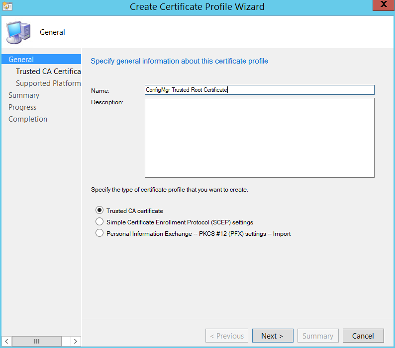
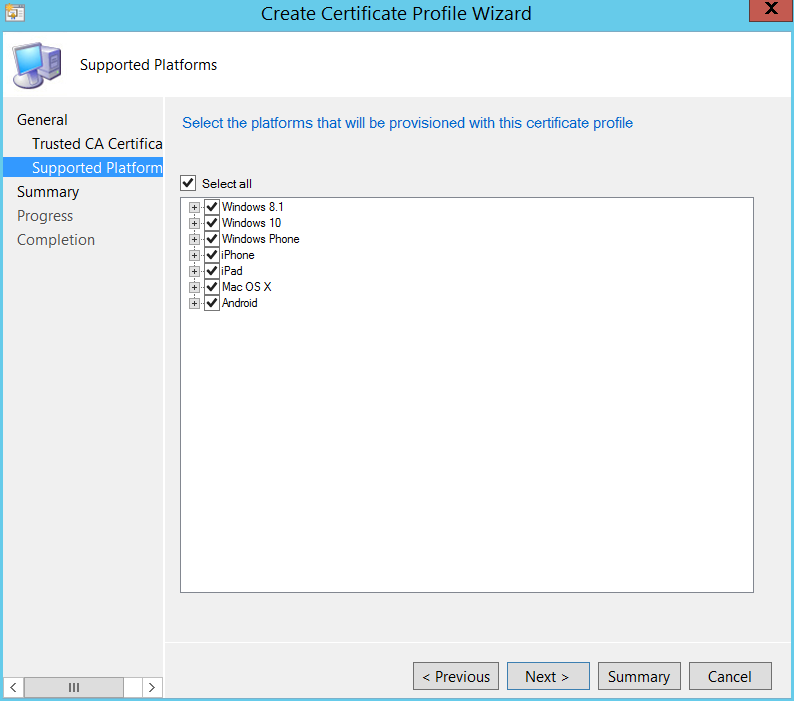
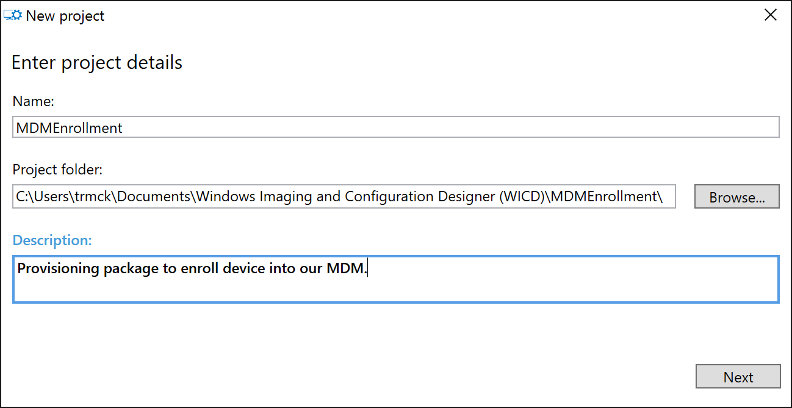
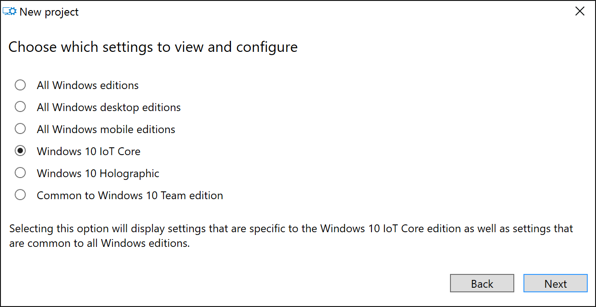
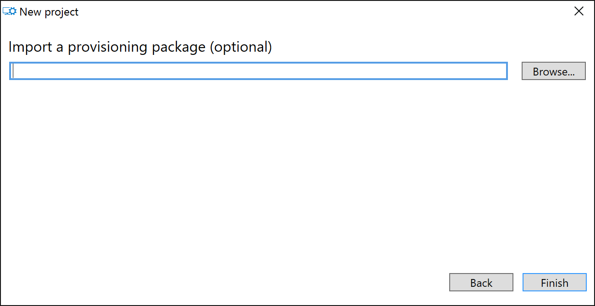

# Managing Windows 10 IoT Core Devices

Windows 10 IoT Core devices can be managed using a traditional OMA DM MDM server that supports certificate based enrollment or using Azure IoT Hub's Device Management.  

 _Learn more about MDM and Windows 10 [here](https://msdn.microsoft.com/library/windows/hardware/dn914769(v=vs.85).aspx)._  
 _Learn more about Azure IoT Hub Device Management [here](https://azure.microsoft.com/en-us/documentation/articles/iot-hub-device-management-overview/)._  

For devices that are managed using a OMA DM server the MDM policies for Windows 10 IoT Core align with the policies supported in other editions of Windows 10. To learn more about policies as well as what can be managed on IoT Core devices, see Configuration service provider reference for Windows 10 [here](https://aka.ms/csplist). The MDM support in Windows 10 is based on Open Mobile Alliance (OMA) Device Management (DM) protocol 1.2.1 specification.

## How do I enroll an IoT Core device into a MDM?
___
MDM enrollment of an IoT Core device is accomplished using a Provisioning package. Provisioning packages can be created using Windows Image Configuration and Designer (WICD). Let's try enrolling a device into a MDM.

### Creating a Provisioning package

#### Microsoft System Center Configuration Manager (Standalone or SCCM+Intune Hybrid)

1.  Open the Configuration Manager Management Console (ConfigMgr Console)

2.  Navigate to _Assets and Compliance > Compliance Settings > Company Resource Access > Certificate Profiles_

3.  Click **Create Certificate Profile**

4.  Provide a name and description for the profile
    - Name: ConfigMgr Example Trusted Root Certificate
     - Type of certificate profile: Trusted CA certificate  
     

5.  Click **Next**.

6.  Import the certificate file.

7.  Select **Computer certificate store - Root** for the **Destination Store**.

8.  Click **Next**.

9.  Choose **Select all** for Supported Platforms
    

10. Click **Summary, Next, and Close** to exit the wizard.

11. Right-click on the profile just created and click **Export**.

12. Click **Browse**, find a location where the .ppkg file should be exported, and then click **Save**.

13. Click **Export** and click **OK** to exit the wizard.

#### Other MDM Servers

1.  Download and install the [Windows Assessment and Deployment Kit (Windows ADK)](https://developer.microsoft.com/en-us/windows/hardware/windows-assessment-deployment-kit).

2.  Open Windows Imaging and Configuration Designer (WICD).
    

3.  Choose **Advanced Provisioning**

4.  Set a name for your package.

5.  Choose settings common to Windows 10 IoT Core.

6.  Skip the Import Package step.
     
     
    

7. Navigate to Workplace -> Enrollments.

8.  In the UPN field enter the account you wish to enroll your device under (i.e. trmck@contoso.co) and click **Add**.

    

9. For AuthPolicy choose between Username Password based authentication (OnPremises) or Certificate based authentication.

10. Enter the Discovery Service URL for your MDM server.

> [!NOTE]
> Enrollment Service URL and Policy Service URL are optional.

11. For the Secret enter  
    - OnPremises: The password for the account you're enrolling with  
    - Certificate: The thumbprint of the certificate
    
      

12. At the top of WICD window click **Export > Provisioning package**.

13. Provide a name and version for your package and click **Next**. 

> [!NOTE]
> Be sure to increment the version number to ensure an updated package is executed.

14. Click **Next** on the **security details page**.

15. Choose the location where the package is to be exported on the local machine and click **Next**.

16. Click **Build** and then **Finish** to exit the wizard.

### Installing the Provisioning package

There are a few ways in which a Provisioning package can be deployed to an IoT device. It is possible to deploy a package by copying the package to the device or adding the package to the image during the imaging process.

#### Copying package to device

Take the Provisioning package that was exported from SCCM or WICD and copy the .ppkg file to `C:\Windows\Provisioning\Packages` directory on the IoT device. Upon reboot of the device the package will be executed and the device will start the enrollment process.

#### Adding package to image

See [Add a provisioning package to an image](https://msdn.microsoft.com/en-us/windows/hardware/commercialize/manufacture/iot/add-a-provisioning-package-to-an-image). Upon first boot the device will execute the package and start the enrollment process.
