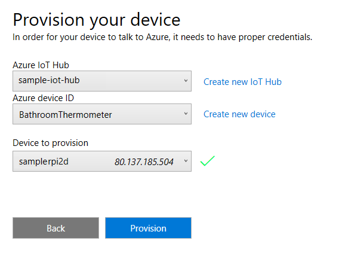

# Connect your device to the cloud

Storing secure information such as a password or a certificate on a device could
make a device vulnerable to exposure. A leaked password is a surefire way to
compromise the security of a device or an entire system. In the Windows family,
the technology that supports the security of the OS is the Trusted Platform Module.

A [Trusted Platform Module](https://en.wikipedia.org/wiki/Trusted_Platform_Module) (TPM) device is a microcontroller that can store data and perform computations. It can be either a discrete chip soldered to a computer's
motherboard or a module integrated into the system on a chip (SoC) by the manufacturer. 

## Inside the TPM 

A key capability of the TPM is its write-only memory. Based on the data in it,
TPM can also compute a cryptographic hash (such as the [HMAC](https://en.wikipedia.org/wiki/Hash-based_message_authentication_code)), based on that data.
It’s impossible to uncover the secret given the hash, but if the secret is known
to both parties of communication, it is possible to determine whether the hash
received from another party was produced from that secret.

The basic idea behind using cryptographic keys: the secret (also called the
shared access key) is established and shared between the IoT device and the
cloud during the device provisioning process. From that point on, an HMAC
derived from the secret will be used to authenticate the IoT device.

## Device Provisioning 

The tool that provisions Windows 10 IoT Core devices is called the IoT Core
Dashboard and can be downloaded from [the downloads page](https://go.microsoft.com/fwlink/?LinkID=708576).

The dashboard produces an image of the OS and securely connects your device to
Azure. This is done by associating the physical device with the device ID in the Azure IoT Hub
and imprinting the device-specific shared access key to the device's TPM. 

For devices that don’t have a TPM chip, the tool can install a software-emulated
TPM. This does not provide security but allows you to develop your app
using a maker device (such as Raspberry Pi 2 or 3) and have security "light up"
on a device with the hardware TPM without having to change the app. 

To connect your device to Azure, click on the "Connect to Azure" tab:

You will be asked to log in to your Azure account. Pick the desired instance of
Azure IoT Hub and associate your physical device with it. If you don’t have any
IoT Hub instances in your Azure subscription, the tool will let you create a
free instance. 

Once you have selected the IoT Hub and the device ID to associate your device
with, you can imprint the shared access key of that device on your TPM:

Your device is now ready to connect to Azure in a secure way. 

You can also use the Windows Device Portal to dynamically acquire an IoT Hub connection string when it first connects to the internet after being provisioned. This can be done from the "Azure Clients" tab in the Device Portal.

## Helpful resources:
* [Connecting your app to Azure](../connect-to-cloud/ConnectAppToCloud.md)
* [Building secure apps for IoT Core](https://blogs.windows.com/buildingapps/2016/07/20/building-secure-apps-for-windows-iot-core/#oqFLXiWIL1iCF8j9.97)
