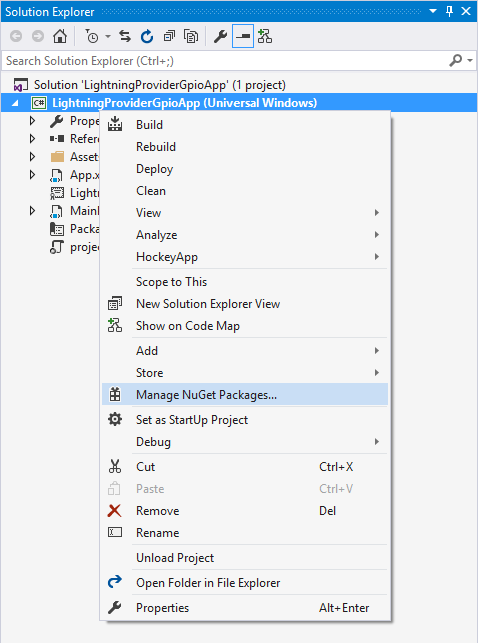
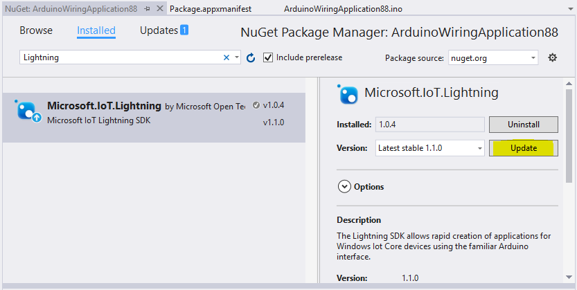

# Working with lightning providers
The Microsoft.IoT.Lightning.Providers library contains a set of providers to interface with the on board controller buses through the Lightning direct memory mapped driver (DMAP).


## About the direct memory mapped driver (DMAP)

The DMAP driver is an in-developement driver that provides GPIO performance improvements over the default inbox driver. to lean more about these performance improvements visit the [Lightning Performance Testing](LightningPerformance.md) page.

While DMAP driver offer GPIO performance improvements over the Inbox driver, controller commands are sent to the DMAP driver through user-mode memory mapped addresses for each of the controllers. An app that only uses the Lightning provider APIs or Microsoft.IoT.Lightning.Providers. However, a malicious app would be able to write directly to that memory and cause hardware/security issues. On a machine with only trusted apps, the DMAP is generally safe to use.   

## Obtaining the library

The library is provided as part of the [Lightning SDK Nuget package](https://www.nuget.org/packages/Microsoft.IoT.Lightning) with source code available on [GitHub ms-iot/Lightning repository](https://github.com/ms-iot/lightning/).

Additonally, samples showing how to use the different providers are available on [GitHub ms-iot/BusProviders repository](https://github.com/ms-iot/BusProviders/tree/develop/Microsoft.IoT.Lightning.Providers).

## Adding the library to your application

### Option 1: Starting from an existing sample
A quick way to start coding using the Lightning providers is to start with one of the samples in the [GitHub ms-iot/BusProviders repository](https://github.com/ms-iot/BusProviders/tree/develop/Microsoft.IoT.Lightning.Providers).

Each of the samples references the Lightning SDK and is configured properly to use the Lightning providers library.

**Note**, To run the samples, the DMAP driver need to be enabled using the Windows Devices Web Portal. Refer to the [Lightning Setup Guide](LightningSetup.md) for detailed information on how to enable it.

### Option 2: Referencing the library

Additionally, it's straightforward to add the required Lightning providers Nuget reference and support to a new or existing application. Follow the steps below:

1. In your application, right click the project and click the "Manage NuGet Packages..." menu item


2. The NuGet Package Manager will open. In the Browse tab, search for the "Lightning SDK", making sure to check the "Include prerelease" checkbox.

3. Select the latest version, and click "Install" to add the Lightning SDK to your project. 


4. Follow any on-screen instructions if needed. When installation is complete, a reference to the Lightning SDK will be added to your project.


5. Add the code below to your manifest file, Package.appxmanifest.

``` XML
<iot:Capability Name="lowLevelDevices" />
<DeviceCapability Name="109b86ad-f53d-4b76-aa5f-821e2ddf2141"/>
```

* The first is a capability that will enable the application to access custom devices.
* The second is the device guid id for the Lightning interface

Both capabilities must be added to the AppX manifest of your project under the `<Capabilities>` node. Also, make sure to add the required namespaces to your manifest if needed.


## Updating your code to use the Lightning providers

### Checking for the Lightning (DMAP) driver

To check if Lightning is enabled, the `LightningProvider.IsLightningEnabled` property should be used. In general, it is always a good practice to verify if the Lightning driver is enabled before using the Lightning provider APIs. 

``` C#
if (Microsoft.IoT.Lightning.Providers.LightningProvider.IsLightningEnabled)
{
    // Do something with the Lightning providers
}
```

### General usage pattern

The simplest way to use the providers is to set the Lightning Provider as the default inside your app. 

The code below will, if the Lightning Provider is available, set `Microsoft.IoT.Lightning.Providers.LightningProvider` as the default provider. Otherwise, when no default provider is explicitly set, the various busses will fall back to the default one.
``` C#
using Microsoft.IoT.Lightning.Providers;
using Windows.Devices;
if (LightningProvider.IsLightningEnabled)
{
    LowLevelDevicesController.DefaultProvider = LightningProvider.GetAggregateProvider();
}

gpioController = await GpioController.GetDefaultAsync();
i2cController = await I2cController.GetDefaultAsync();
spiController = await SpiController.GetDefaultAsync();
```

After you have a controller for the desired bus, you can use it as you normally would. 

### Using Lightning for individual buses

If you want to use a different default provider, the sections below show how you can use the Lightning providers for individual busses. 

#### For GPIO bus controller:

``` C#
using Microsoft.IoT.Lightning.Providers;
using Windows.Devices;
using Windows.Devices.Gpio;

if (LightningProvider.IsLightningEnabled)
{
    GpioController gpioController = (await GpioController.GetControllersAsync(LightningGpioProvider.GetGpioProvider()))[0];
    GpioPin pin = gpioController.OpenPin(LED_PIN, GpioSharingMode.Exclusive);
}
```

#### For I2C bus controller:

``` C#
using Microsoft.IoT.Lightning.Providers;
using Windows.Devices;
using Windows.Devices.I2c;

if (LightningProvider.IsLightningEnabled)
{
    I2cController controller =  (await I2cController.GetControllersAsync(LightningI2cProvider.GetI2cProvider()))[0];
    I2cDevice sensor = controller.GetDevice(new I2cConnectionSettings(0x40));
}
```

#### For SPI bus controller:
using Microsoft.IoT.Lightning.Providers;
using Windows.Devices;
using Windows.Devices.Spi;

``` C#
if (LightningProvider.IsLightningEnabled)
{
    SpiController controller =  (await SpiController.GetControllersAsync(LightningSpiProvider.GetSpiProvider()))[0];
    SpiDevice SpiDisplay = controller.GetDevice(spiConnectionSettings);
}
```

## Lightning Provider Samples

The following samples demonstrate using the Lightning providers with supported bus types:

* [Blinky (UI) with Lightning Provider](https://developer.microsoft.com/en-us/windows/iot/samples/helloblinkylightning) demonstrates GPIO with Lightning Provider in a foreground application

* [BlinkyHeadless with Lightning Provider](https://developer.microsoft.com/en-us/windows/iot/samples/helloblinkybackgroundlightning) demonstrates GPIO with Lightning Provider in a headless application

* [SPIDisplay with Lightning Provider](https://developer.microsoft.com/en-us/windows/iot/samples/spidisplaylightning) demonstrates the usage of the API to control a device using SPI with Lightning Provider
 
* [WeatherStation with Lightning Provider](https://developer.microsoft.com/en-us/windows/iot/samples/weatherstationlightning) demonstrates interacting with a device using I2C with Lightning Provider

## Build Requirements


### Windows SDK Update

Windows SDK required for building and using the library is 10.0.10586.0 or higher which can be downloaded from [here](https://dev.windows.com/en-US/downloads/windows-10-sdk).

For more information on setting everything up, refer to [our get started guide.](https://developer.microsoft.com/en-us/windows/iot/getstarted).

### Nuget Package Dependencies

The Lightning Provider library depends on the [Microsoft.IoT.Lightning Nuget package](https://www.nuget.org/packages/Microsoft.IoT.Lightning), which in turn depends on the [Arduino SDK Nuget package](https://www.nuget.org/packages/Microsoft.IoT.SDKFromArduino). Both Nuget packages are referenced in the library projects, and are available from Nuget.org.

If needed, source code for each is also available on GitHub at the [Lightning](https://github.com/ms-iot/lightning) and [Arduino SDK](https://github.com/ms-iot/arduino-sdk) repositories.

Currently, Microsoft.IoT.Lightning Nuget is still pre-release, so should be updated from Nuget.org, when newer versions are available.

In order to install prerelease (current) version of Microsoft.IoT.Lightning Nuget package as well as receive prerelease updates to the Lightning package, make sure to set the "Include prerelease" option in the Nuget Package Manager.

1. Right click References in your project
1. Click "Manage Nuget Packages..."
1. Select package sources for Lightning nuget
1. Click "Include prerelease".
1. Click "Install" to install the nuget package to your project



## Runtime Requirements

### Windows IoT Core Fall Update required
Lightning providers support is currently included in the Fall Update builds for Windows IoT Core.
You can download a Windows 10 IoT Core image from our [downloads page](https://developer.microsoft.com/windows/iot/Downloads). Click on "Download Insider Preview" for your device type.

### Direct Memory Mapped driver must be enabled
 
The APIs in the Lightning Provider library require the Lightning Direct Memory Mapped driver to be enabled on the target device. Both Raspberry Pi 2/3 and MinnowBoard Max have the driver available, but not enabled by default.

The driver can be enabled using the Windows Devices Web Portal. Refer to the [Lightning Setup Guide](LightningSetup.md) for detailed information on how to enable the Lightning driver.


The driver can also be enabled with the DmapUtil command:

DmapUtil: Utility to turn the DMAP direct memory mapper driver on or off
Usage: dmaputil.exe status|enable|disable
  status [-v]   Print out whether dmap is currently enabled. Pass the -v flag
                for detailed configuration information.
  enable        Enable dmap on next boot.
  disable       Disable dmap on next boot.
