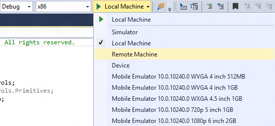
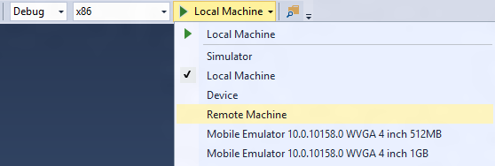
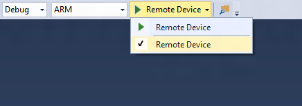

# Deploying an App with Visual Studio

Deploying and debugging your application is straightforward with Visual Studio. We'll use the **Remote Debugging** feature to deploy the app to your locally connected Windows 10 IoT Core device. 

* [C# App Deployment](#csharp)
* [C++ App Deployment](#cpp)
* [Python App Deployment](#python)

> [!NOTE]
> In order to use remote debugging, your IoT Core device must first be connected to same local network as your development PC.  
>See the [Connecting to a device](https://developer.microsoft.com/en-us/windows/iot/Docs/ConnectToDevice) instructions.

<a name="csharp"/>

## Deploy a C# app to your Windows 10 IoT Core device 
___

1. With the application open in Visual Studio, set the architecture in the toolbar dropdown. If you're building for Minnowboard Max, select
`x86`. If you're building for Raspberry Pi 2, Raspberry Pi 3 or the Dragonboard, select `ARM`.

2. Next, in the Visual Studio toolbar, click on the `Local Machine` dropdown and select `Remote Machine`.

3. At this point, Visual Studio will present the **Remote Connections** dialog. If you previously used [PowerShell](../docs/PowerShell.md) to set a unique name for your device, you can enter it here (in this example, we're using **my device**). Otherwise, use the IP address of your Windows IoT Core device.

4. After entering the device name/IP select `Universal (Unencrypted Protocol)` Authentication Mode, then click **Select**. 

You can verify or modify these values by navigating to the project properties (select **Properties** in the Solution Explorer) and choosing the `Debug` tab on the left:

5. Now we're ready to deploy. Simply press F5 (or select Debug \| Start Debugging) to start debugging our app. You should see the app come up on your device's screen.

6. Once deployed, you can set breakpoints, see variable values, etc. To stop the app press on the 'Stop Debugging' button (or select Debug \| Stop Debugging).

7. After successfully deploying and debugging your UWP application, create a Release version - change the Visual Studio toolbar configuration dropdown from `Debug` to `Release`.  You can now build and deploy your app to your device by selecting Build \| Rebuild Solution and Build \| Deploy Solution.

<a name="cpp"/>

## Deploy a C++ app to your Windows 10 IoT Core device

1. With the application open in Visual Studio, set the architecture in the toolbar dropdown. If you're building for Minnowboard Max, select `86`. If you're building for Raspberry Pi 2 or 3, select `ARM`.

2. Next, in the Visual Studio toolbar, click on the `Local Machine` dropdown and select `Remote Machine`

3. Next, right click on your project in the **Solution Explorer** pane. Select **Properties**. 

4. Under **Configuration Properties -> Debugging**, modify the following fields:

	* **Machine Name**: If you previously used [PowerShell](../docs/PowerShell.md) to set a unique name for your device, you can enter it here (in this example, we're using **my-device**). 
Otherwise, use the IP address of your Windows IoT Core device.
	* **Authentication Mode**: Set to **Universal (Unencrypted Protocol)**
	

5. Now we're ready to deploy. Simply press F5 (or select Debug \| Start Debugging) to start debugging our app. You should see the app come up in Windows IoT Core device screen.

6. Once deployed, you can set breakpoints, see variable values, etc. To stop the app, press on the 'Stop Debugging' button (or select Debug \| Stop Debugging).

7. Having successfully deployed and debugged your UWP application, create a Release version - change the Visual Studio toolbar configuration dropdown from `Debug` to `Release`.  You can now build and deploy your app to your device by selecting Build \| Rebuild Solution and Build \| Deploy Solution.

<a name="python"/>

## Deploy a Python app to your Windows 10 IoT Core device

1. With the application open in Visual Studio, set the architecture in the toolbar dropdown. If you're building for MinnowBoard Max, select `x86`.  If you're building for Raspberry Pi 2 or 3, select `ARM`.

2. In the Visual Studio toolbar, make sure the target dropdown is set to `Remote Machine`

3. Next, right click on your project in the **Solution Explorer** pane. Select **Properties**.

4. Under **UWP Project Settings**, modify the following fields:

	* **Machine Name**: If you previously used [PowerShell](../Docs/PowerShell.htm) to set a unique name for your device, you can enter it here (in this example, we're using **my-device**).
	Otherwise, use the IP address of your Windows IoT Core device.
	* **Remote Port**: Set to **5678**
	

5. Now we're ready to deploy. Simply press F5 (or select Debug \| Start Debugging) to start debugging our app.You should see the app come up in Windows IoT Core device screen.

6. Once deployed, you can set breakpoints, see variable values, etc. To stop the app, press on the 'Stop Debugging' button (or select Debug \| Stop Debugging).

7. Having successfully deployed and debugged your UWP application, create a Release version - change the Visual Studio toolbar configuration dropdown from `Debug` to `Release`.  You can now build and deploy your app to your device by selecting Build \| Rebuild Solution and Build \| Deploy Solution.
