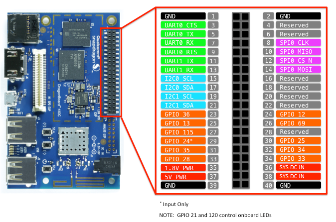

# Dragonboard Pin Mappings



Hardware interfaces for the Dragonboard are exposed through the 40-pin header on the board. Functionality includes:

* **11x** - GPIO pins
* **2x** - Serial UARTs
* **1x** - SPI bus
* **2x** - I2C bus
* **1x** - 5V power pin
* **1x** - 1.8V power pin
* **4x** - Ground pins

Note that the Dragonboard uses 1.8V logic levels on all IO pins. 

## GPIO Pins

Let's look at the GPIO available on this device.

### GPIO Pin Table

The following GPIO pins are accessible through APIs:

{:.table.table-bordered}
> | GPIO# | Header Pin         |
> |-------|--------------------|
> | 36    | 23                 |
> | 12    | 24                 |
> | 13    | 25                 |
> | 69    | 26                 |
> | 115   | 27                 |
> | 24    | 29                 |
> | 25    | 30                 |
> | 35    | 31                 |
> | 34    | 32                 |
> | 28    | 33                 |
> | 33    | 34                 |
> | 21    | User LED 1         | 
> | 120   | User LED 2         |         


As an example, the following code opens **GPIO 35** as an output and writes a digital '**1**' out on the pin:
         
```C#
using Windows.Devices.Gpio;
         
public void GPIO()
{
	GpioController Controller = GpioController.GetDefault(); /* Get the default GPIO controller on the system */

	GpioPin Pin = Controller.OpenPin(35);       /* Open GPIO 35                      */
	Pin.SetDriveMode(GpioPinDriveMode.Output);  /* Set the IO direction as output   */
	Pin.Write(GpioPinValue.High);               /* Output a digital '1'             */
}
```

### GPIO Issues

* Output doesn't work on GPIO 24. Input works fine.
* Pins are configured as InputPullDown at boot, but will change to Input (floating) the first time they are opened
* Pins do not revert to their default state when closed
* Spurious interrupts may be seen when interrupts are enabled on multiple pins


## Serial UART

There are two Serial UARTS available on the Dragonboard **UART0** and **UART1**

**UART0** has the standard **UART0 TX** and **UART0 RX** lines, along with flow control signals **UART0 CTS** and **UART0 RTS**.

* Pin 5  - **UART0 TX**
* Pin 7  - **UART0 RX**
* Pin 3 - **UART0 CTS**
* Pin 9 - **UART0 RTS**


**UART1** includes just the **UART1 TX** and **UART1 RX** lines.

* Pin 11  - **UART1 TX**
* Pin 13  - **UART1 RX**

The example below initializes **UART1** and performs a write followed by a read:

```C#
using Windows.Storage.Streams;
using Windows.Devices.Enumeration;
using Windows.Devices.SerialCommunication;

public async void Serial()
{
	string aqs = SerialDevice.GetDeviceSelector("UART1");                   /* Find the selector string for the serial device   */
	var dis = await DeviceInformation.FindAllAsync(aqs);                    /* Find the serial device with our selector string  */
	SerialDevice SerialPort = await SerialDevice.FromIdAsync(dis[0].Id);    /* Create an serial device with our selected device */

	/* Configure serial settings */
	SerialPort.WriteTimeout = TimeSpan.FromMilliseconds(1000);
	SerialPort.ReadTimeout = TimeSpan.FromMilliseconds(1000);
	SerialPort.BaudRate = 9600;
	SerialPort.Parity = SerialParity.None;         
	SerialPort.StopBits = SerialStopBitCount.One;
	SerialPort.DataBits = 8;

	/* Write a string out over serial */
	string txBuffer = "Hello Serial";
	DataWriter dataWriter = new DataWriter();
	dataWriter.WriteString(txBuffer);
	uint bytesWritten = await SerialPort.OutputStream.WriteAsync(dataWriter.DetachBuffer());

	/* Read data in from the serial port */
	const uint maxReadLength = 1024;
	DataReader dataReader = new DataReader(SerialPort.InputStream);
	uint bytesToRead = await dataReader.LoadAsync(maxReadLength);
	string rxBuffer = dataReader.ReadString(bytesToRead);
}
```

Note that you must add the following capability to the **Package.appxmanifest** file in your UWP project to run Serial UART code:

    Visual Studio 2017 has a known bug in the Manifest Designer (the visual editor for appxmanifest files) that affects the serialcommunication capability.  If 
    your appxmanifest adds the serialcommunication capability, modifying your appxmanifest with the designer will corrupt your appxmanifest (the Device xml child 
    will be lost).  You can workaround this problem by hand editting the appxmanifest by right-clicking your appxmanifest and selecting View Code from the 
    context menu.

```xml
  <Capabilities>
    <DeviceCapability Name="serialcommunication">
      <Device Id="any">
        <Function Type="name:serialPort" />
      </Device>
    </DeviceCapability>
  </Capabilities>
```

## I2C Bus

Let's look at the I2C busses available on this device.

### I2C Pins

**I2C0** exposed on the pin header with two lines **SDA** and **SCL**

* Pin 17 - **I2C0 SDA**
* Pin 15 - **I2C0 SCL**

**I2C1** exposed on the pin header with two lines **SDA** and **SCL**

* Pin 21 - **I2C1 SDA**
* Pin 19 - **I2C1 SCL**

### I2C Sample

The example below initializes **I2C0** and writes data to an I2C device with address **0x40**:

```C#
using Windows.Devices.Enumeration;
using Windows.Devices.I2c;

public async void I2C()
{
    // 0x40 is the I2C device address
    var settings = new I2cConnectionSettings(0x40);
    // FastMode = 400KHz
    settings.BusSpeed = I2cBusSpeed.FastMode;

    // Get a selector string that will return our wanted I2C controller
    string aqs = I2cDevice.GetDeviceSelector("I2C0");
    
    // Find the I2C bus controller devices with our selector string
    var dis = await DeviceInformation.FindAllAsync(aqs);

    // Create an I2cDevice with our selected bus controller and I2C settings 
    using (I2cDevice device = await I2cDevice.FromIdAsync(dis[0].Id, settings))
    {
        byte[] writeBuf = { 0x01, 0x02, 0x03, 0x04 };
        device.Write(writeBuf);
    }
}
```


## SPI Bus

Let's look at the SPI bus available on this device.

### SPI Pins

There is one SPI controller **SPI0** available on the DB

* Pin 10 - **SPI0 MISO**
* Pin 14 - **SPI0 MOSI**
* Pin 8 - **SPI0 SCLK**
* Pin 12 - **SPI0 CS0**

### SPI Issues

The SPI clock is fixed at 4.8mhz. The requested SPI clock will be ignored. 


### SPI Sample

An example on how to perform a SPI write on bus **SPI0** is shown below:

```C3
using Windows.Devices.Enumeration;
using Windows.Devices.Spi;

public async void SPI()
{
    // Use chip select line CS0
    var settings = new SpiConnectionSettings(0);

    // Create an SpiDevice with the specified Spi settings
    var controller = await SpiController.GetDefaultAsync();

    using (SpiDevice device = controller.GetDevice(settings))
    {
        byte[] writeBuf = { 0x01, 0x02, 0x03, 0x04 };
        device.Write(writeBuf);
    }
}
```
