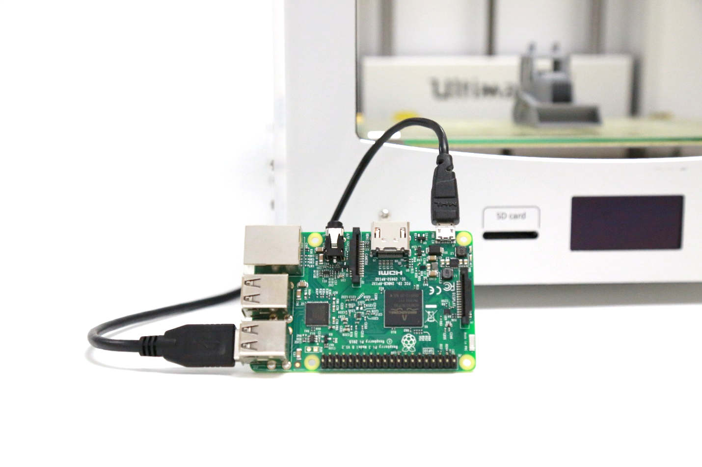

# Network 3D Printer with Windows 10 IoT Core

Turn your Windows 10 IoT Core device into a print server and connect your 3D Printer to it. You will be able to access your printer wirelessly from other devices.

## 1. Install Windows 10 IoT Core on your device
___
Before you start, you will need:

* A board with the latest version of Windows 10 IoT Core Insider Preview installed. Follow the [Get Started guide](https://developer.microsoft.com/en-us/windows/iot/getstarted) to get the IoT Dashboard app and install Windows 10 IoT Core.
* A 3D Printer compatible with our Network 3D Printer app:

    * Lulzbot Taz 6
    * Makergear M2
    * Printrbot Play, Plus and Simple
    * Prusa i3 Mk2
    * Ultimaker Original and Original+
    * Ultimaker 2 and 2+
    * Ultimaker 2 Extended and Extended+
    * CraftBot 2
    * CraftBot PLUS
    * LulzBot Mini
    * Velleman K8200

## 2. Connect your 3D Printer to your device
___
* Plug-in your 3D printer to your Windows 10 IoT Core board using the USB cable.

    

* Open the IoT Dashboard app and verify that your device shows up in the **My devices** tab.

    
    
## 3. Deploy the Network 3D Printer app
___
* In IoT Dashboard, click on the **Try some samples** section.
* Select the Network 3D Printer sample app.

   

* Select your 3D Printer model and press the **Deploy and run** button to deploy the app to your IoT Core device. 

    

    [LulzBot TAZ 6 image](http://devel.lulzbot.com/TAZ/Olive/photos/TAZ_6_Angle_Rock2pus_transparent.png) by [Aleph Objects, Inc.](https://www.alephobjects.com/) is licensed under [CC BY-SA 4.0](https://creativecommons.org/licenses/by-sa/4.0/).
    
## 4. Add your 3D Printer
___
* Go to your Windows 10 PC and go to **Settings** -> **Devices** -> **Printers & Scanners**.
* Press **Add a printer or scanner**.

     

* Select your 3D Printer and press **Add device**. The printer will install automatically.

     

Congratulations your printer is now installed and will behave exactly as if it was connected with a USB cable.
You can now print to it using [3D Builder](https://msdn.microsoft.com/windows/hardware/mt561568.aspx).
