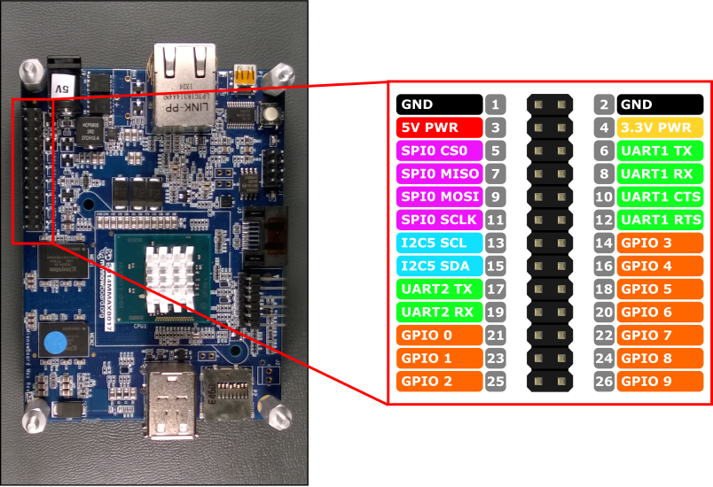
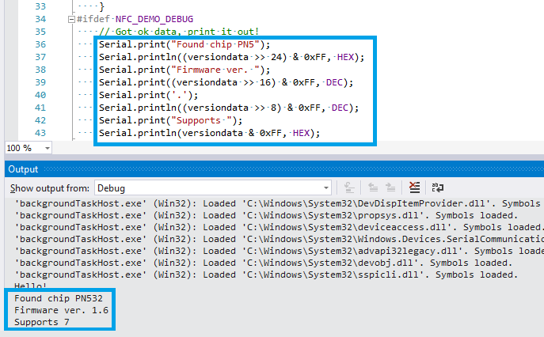
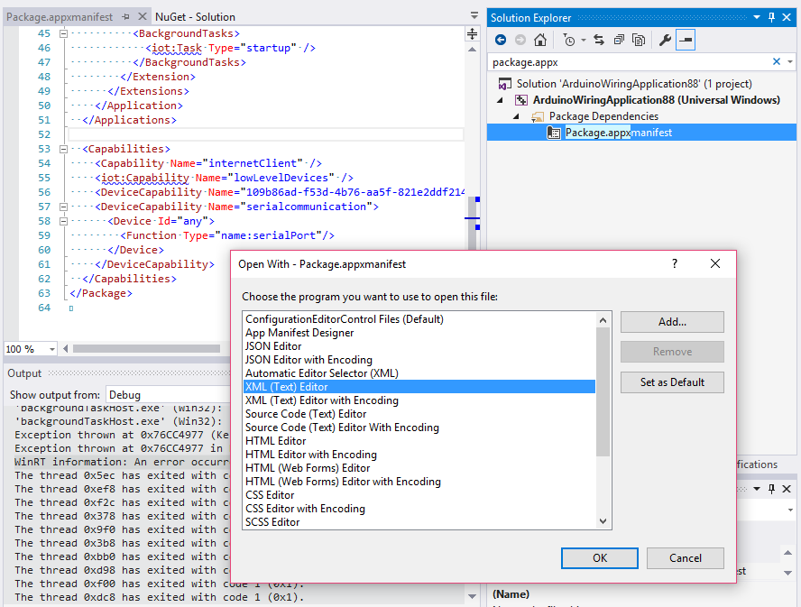

# Arduino Wiring Porting Guide

Arduino Wiring sketches and libraries can be copy/pasted into an Arduino Wiring project inside Visual Studio and run on Raspberry Pi 2, Raspberry Pi 3 or Minnowboard Max. Sometimes there are slight modifications that need to be made to these files in order to make them more compatible with the Windows environment, or the board you are working with. This guide will cover those modifications as well as common issues that you may run into when deploying Arduino Wiring projects.

## Porting

### Updating Pins

It might go without saying, but many sketches and libraries (especially those for arduino shields) may contain references to specific connector pins for Arduino devices. You'll want to customize your sketches to use the appropriate connector pins for the device you are working on and the configuration you are using.

Arduino Wiring ultimately requires a physical connector pin number for any functions that refer to 'pins'. You can use these numbers directly, but we've also provided some pre-defined pin names which correspond to connector pins on specific boards.

For example, the physical connector pin 29 on a Raspberry Pi 2 and 3 is also known as `GPIO5`. You may set GPIO pin 5 to a HIGH state on a Raspberry Pi 2 and 3 by using either of the following commands:
```
pinMode( 29, OUTPUT );
digitalWrite( 29, HIGH );
```

or

```
pinMode( GPIO5, OUTPUT );
digitalWrite( GPIO5, HIGH );
```

The pre-defined pin names can be found in [pins_arduino.h](https://github.com/ms-iot/lightning/blob/develop/source/pins_arduino.h) and included in every Arduino Wiring project, but since there will be different physical connector pins available depending on the hardware setup you are building for, we've also included a table here to describe which pin names are available for each device.

#### Raspberry Pi 2 and 3


> [!div class="mx-tdBreakAll"]
> | Pin Define | Corresponding Pin Number|
> |-------------|----------|
> | LED_BUILTIN | *onboard LED* |
> | GPIO* _where * refers to [0, 27]_ | *refer to pinout diagram* |
> | GCLK | 7 |
> | GEN* _where * refers to [0, 5]_ | *refer to pinout diagram |
> | SCL1 | 5 |
> | SDA1 | 3 |
> | CS0 (or CE0 or SS) | 24 |
> | CS1 (or CE1) | 26 |
> | SCLK (or SCK) | 23 |
> | MISO | 21 |
> | MOSI | 19 |
> | RXD | 10 |
> | TXD | 8 |

#### Minnowboard Max


> [!div class="mx-tdBreakAll"]
> | Pin Define | Corresponding Pin Number|
> |-------------|----------|
> | GPIO* _where * refers to [0, 9]_  | *refer to pinout diagram* |
> | SCL | 13 |
> | SDA | 15 |
> | CS0 (or CE0 or SS) | 5 |
> | SCLK  (or SCK)| 11 |
> | MISO |7 |
> | MOSI | 9 |
> | CTS1 | 10 |
> | RTS1 | 12 |
> | RX1 | 8 |
> | TX1 | 6 |
> | RX2 | 19 |
> | TX2 | 17 |


## Common Problems

### Can't find "Arduino Wiring Application" Visual C++ project template in Visual Studio

**Cause**: The Windows IoT Project Templates extension for Visual Studio is not installed.

**Solution**: You must install the Visual Studio Extension for Windows IoT Project Templates before you can create Arduino Wiring projects in Visual Studio. Head over to [Windows IoT Core Project Templates extension page](https://go.microsoft.com/fwlink/?linkid=847472) to download the extension from the Visual Studio Gallery!

### ERROR: "identifier not found" when calling a function

**Cause**: This error occurs during the linker process when a function is invoked that has not yet been declared in the document.

**Solution**: In C++, all functions must be declared before they are invoked. If you have defined a new function in your sketch file, either the declaration or the entire implementation of the function must be above any attempts to invoke it (typically at the top of the document).

**Example**:

The following block of code will raise the error "'myFunction': identifier not found"

```
void setup()
{

}

void loop()
{
    myFunction();
}

void myFunction()
{
    //do something
}
```

There are two solutions. First, you may declare the function above any invocations. Typically, this declaration is done at the top of the file.

```C++
// Declare function here
void myFunction();

void setup()
{

}

void loop()
{
    myFunction();
}

// And, define the function here
void myFunction()
{
    //do something
}
```

Alternatively, you can move the entire implementation of the function above any invocations. This has the effect of both declaring and defining the function at the same time.

```C++
void setup()
{
}

void myFunction()
{
    //do something
}

void loop()
{
    myFunction();
}
```

### My solution hangs infinitely when being initialized

There is a known issue which can cause a C++ solution to hang infinitely (deadlock) when being initialized. You may be experiencing this type of issue if you find that your solution appears to hang forever and you are unable to use the debugger to 'break in' to any statement in the setup() or loop() sections of your Arduino Wiring application.

**Cause**: An object is being created or a function is being called which leads to an asyncronous action before the solution has finished initializing. It is likely caused from an object's constructor calling an API function like `pinMode`.

**Solution**: Move any object constructors and function calls away from the initialization section of code and into the `setup()` block.

**Example 1**:

The execution of this sketch calls a function called `setPinModes()` before the solution itself has been initialized. The solution will appear to execute but will hang infinitely.

```C++
bool setPinModes();

int pin = GPIO5;
bool initialized = setPinModes();

void setup()
{

}

void loop()
{
	if( initialized )
	{
		//do something
	}
}

bool setPinModes()
{
	if( pin < 0 ) return false;
	pinMode( pin, OUTPUT );
	return true;
}
```

The solution is below, we've simply moved the execution of `setPinModes()` to the `setup()` function:

```C++
bool setPinModes();

int pin = GPIO5;
bool initialized;

void setup()
{
	initialized = setPinModes();
}

void loop()
{
	if( initialized )
	{
		//do something
	}
}

bool setPinModes()
{
	if( pin < 0 ) return false;
	pinMode( pin, OUTPUT );
	return true;
}
```

**Example 2**:

The execution of this sketch creates an object on the stack before `setup()` has been called. Since the object calls `pinMode` in its constructor, this will also cause a deadlock. This is an uncommon issue, but may occur with objects from certain libraries (like the Arduino `LiquidCrystal` library).

```C++
class MyObject
{
public:
    MyObject()
    {
        pinMode( GPIO5, OUTPUT );
    }

    void doSomething()
    {
        //... 
    }
};

MyObject myObject;

void setup()
{
}

void loop()
{
    myObject.doSomething();
}
```

The solution is below. We've changed the object to an object pointer and moved the initialization of the object to `setup()`.

```C++
class MyObject
{
public:
    MyObject()
    {
        pinMode( GPIO5, OUTPUT );
    }

    void doSomething()
    {
        //... 
    }
};

MyObject *myObject;

void setup()
{
    myObject = new MyObject();
}

void loop()
{
    myObject->doSomething();
}
```

### Using `Serial.print()` and `Serial.println()`

Many Arduino sketches use `Serial` to print data to the serial console (if opened) or to write to the serial lines (USB or tx/rx). 
In prior versions of the Lightning SDK, Hardware `Serial` support wasn't included, so we provided a `Log()` function which will print to the debugger output window in Visual Studio. `Serial.print*()` or `Serial.write()` had to be removed.

However, starting with <em>Lightning SDK v1.1.0</em>, we've added `Hardware Serial` support and both `Serial.print*()` or `Serial.write()` functions are fully supported. So, if you are copying a sketch built for an Arduino, you won't need to replace any of these Serial references in the Windows IoT version of the sketch.

Furthermore, we've extended the functionality of `Serial.print()` and `Serial.println()`, to output to the debugger window when a debugger is attached - in addition to writing to the hardware serial pins.
The debug output printing is set as the default since reading that output is what most users would want when running their sketches. However, that functionality can be disabled as well; e.g. to improve performance, simply call `Serial.enablePrintDebugOutput(false);` to disable it in your sketch. To re-enable it, call `Serial.enablePrintDebugOutput(true);`. Writing to the hardware serial pins is not affected by those calls.

Note, you do NOT need to attach any peripheral to your serial pins such as an FTDI, to get output sent to the debugger window. However, you'll need to make sure the debugger window is open while your application is being debugged.



The project templates have been updated on the [Windows IoT Core Project Templates extension page](https://go.microsoft.com/fwlink/?linkid=847472) to enable using Hardware `Serial` out of the box. However, if your Arduino Wiring application has already been created using an older project template version, you'll need to 1) Upgrade your project to the latest Lightning SDK, v1.1.0 or later, and 2) add the required Hardware Serial device capability to your AppxManifest to be able to use `Serial`.

### Hardware Serial device capability requirements

Hardware Serial functionality in Windows 10 IoT Core requires device capability declarations added to the AppX manifest.

Find the file `Package.appxmanifest` in your project, by typing the file name in the solution explorer. Then, right click the file and choose 'Open With...'. Choose 'XML (Text) Editor' and click 'OK'.



In the appx manifest file editor, add the `serialcommunication` DeviceCapability to your project as in the following XML snippet:

```xml
<Capabilities>
  <Capability Name="internetClient" />

  <!-- General Arduino Wiring required capabilities -->
  <iot:Capability Name="lowLevelDevices" />
  <DeviceCapability Name="109b86ad-f53d-4b76-aa5f-821e2ddf2141"/>

  <!-- The serialcommunication capability is required to access Hardware Serial. --> 
  <DeviceCapability Name="serialcommunication">
    <Device Id="any">
      <Function Type="name:serialPort"/>
    </Device>
  </DeviceCapability>

</Capabilities>
```

### Upgrade your project to the latest Lightning SDK

The Arduino Wiring projects depend on the [Lightning SDK Nuget package](https://www.nuget.org/packages/Microsoft.IoT.Lightning/) to implement the required Arduino Wiring functions and declarations as well as interface with the Lightning driver. The latest Lightning SDK will contain the latest improvements and bug fixes. To upgrade to the latest Lightning SDK, follow these steps:

- In the Solution Explorer, right click on your project and click 'Manage Nuget Packages...'
- In the NuGet Package Manager, go to the 'Installed' tab. You should see the Microsoft.IoT.Lightning package installed
- Available versions will be listed inside the 'Version' combobox.
- Choose the latest version, and click 'Update' to update your package.
- Notice, to upgrade to a prerelease version, make sure to check the 'Include prerelease' checkbox as well.


