# Embedded mode

Windows and Windows Mobile can be configured to allow embedded mode. Embedded Mode enables:

* Background Applications
* Use of the lowLevelDevice capability
* Use of systemManagement capability

Embedded mode is only enabled by default on Window IoT Core and must be enabled on standard Windows and Windows Mobile.

## Background Applications

Background Applications are created using the Background Application (IoT) template in Visual Studio.  For more information about the Background Application (IoT) template see [Windows IoT Core Project Templates](https://go.microsoft.com/fwlink/?linkid=847472).  

Background applications run without stopping and have no resource limits enforced by resource manager. Also, if the background application stops for some reason and embedded mode is enabled the background application will be restarted by the system.  

While the system will automatically restart background applications, system lockdown features must be enabled to prevent users from stopping or interfering with the operation of Background Applications.

## lowLevelDevice Capability

The lowLevelDevice Capability (only on IoT Core) gives access to low-level hardware interfaces like GPIO, SPI, and I2C. 

* [Blinky Sample(GPIO)](https://developer.microsoft.com/en-us/windows/iot/samples/helloblinky)
* [SPI Accelerometer Sample](https://developer.microsoft.com/en-us/windows/iot/samples/SPIaccelerometer)
* [I2C Accelerometer Sample](https://developer.microsoft.com/en-us/windows/iot/samples/I2Caccelerometer) 

## systemManagment Capability

When you enable the systemManagment capabilities for your appliction this is the set of APIs that gets unlocked:   

* [Windows.System.ProcessLauncher](https://msdn.microsoft.com/library/windows/apps/windows.system.processlauncher.aspx)
* [Windows.System.TimeZoneSettings](https://msdn.microsoft.com/library/windows/apps/windows.system.timezonesettings.aspx)
* [Windows.System.ShutdownManager](https://msdn.microsoft.com/library/windows/apps/windows.system.shutdownmanager.aspx)
* [Windows.Globalization.Language.TrySetInputMethodLanguageTag](https://msdn.microsoft.com/library/windows/apps/windows.globalization.language.trysetinputmethodlanguagetag.aspx)

## Debugging Background Applications 

If you are debugging on a device that is not running Windows IoT Core and you see either of the following error messages you need to ensure AllowEmbeddedMode is enabled on the device and that the Embedded Mode service is running:

* There are no more endpoints available from the endpoint mapper.
* This program is blocked by group policy. For more information, contact your system administrator.

## Changing the mode
To enable embedded mode you will need to create a provisioning package in Imaging and Configuration Designer (ICD) that sets AllowEmbeddedMode=1.  To install ICD you need to download and install the Windows ADK for Windows 10.

* [Download the Windows ADK for Windows 10](http://go.microsoft.com/fwlink/p/?LinkId=526740)
* [Learn about what's new in the Windows ADK for Windows 10](https://msdn.microsoft.com/library/windows/hardware/dn927348(v=vs.85).aspx)

1. When installing the ADK select **Imaging and Configuration Designer (ICD)**
2. After installation is complete run Windows Imaging and Configuration Designer (WICD).

    

3. Click **Advanced provisioning**.  Name the project **AllowEmbeddedMode** and click **Next**.
    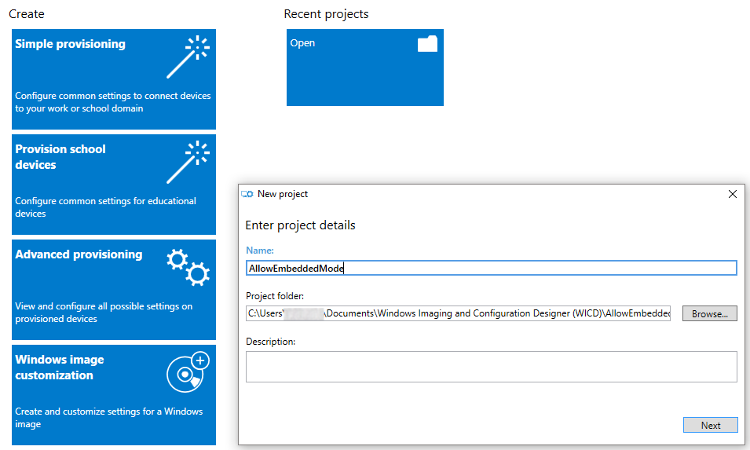

4. Choose **Common to all Windows editions** then **Next**.
    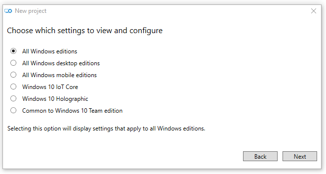

5. Click **Finish**.

    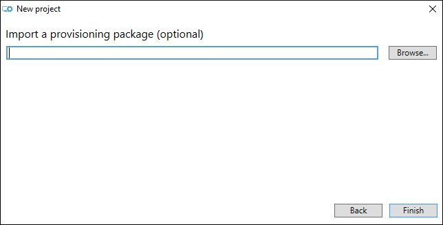

6. In the search box type **EmbeddedMode** and then click on **AllowEmbeddedMode**.

    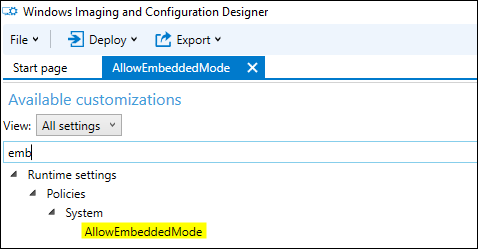

7. In the center pane set the value of **AllowEmbeddedMode** to **Yes**
    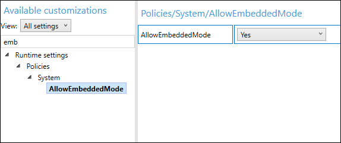

8. Click Export > Provisioning Package

    

9. Click Next.

    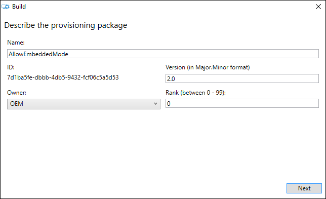

10. Click Next.

    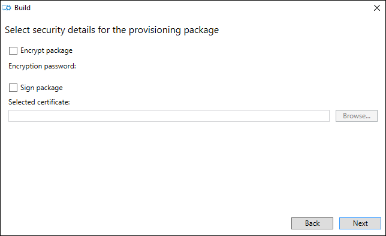

11. Click Next.

    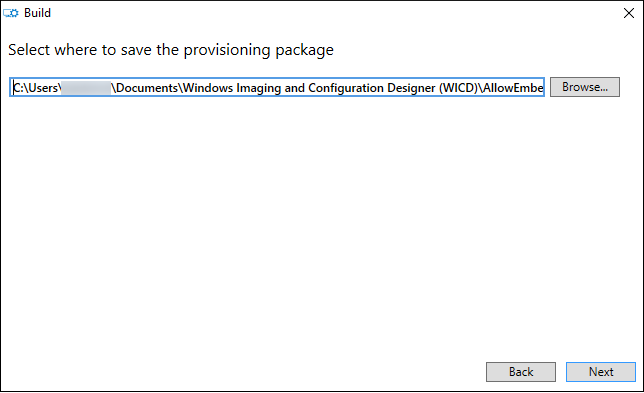

12. Click Build.

    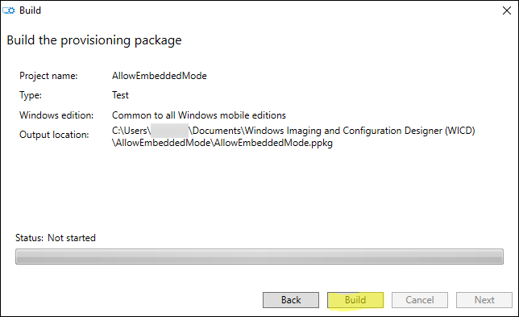

13. Install the provisioning package (PPKG).
    * If enabling embedded mode on standard windows double-click on the PPKG. 
    * If enabling embedded mode on mobile drag the PPKG and drop it on the windows phone icon in explorer.
    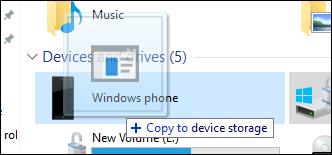

14. Click **Yes, add it**.
    * On standard windows click yes on the LUA dialog if it appears, and the click **Yes, add it** on the dialog.
    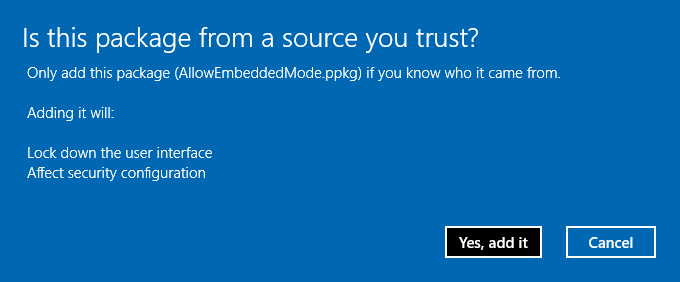
    
    * On mobile look at your phone and on the phone press the **Yes, add it** button.
    
    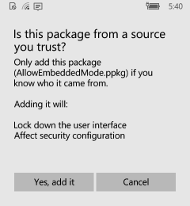

## Configuring a Background Application to Run automatically
1. To configure a Background Application to automatically run you will need to follow the directions to [create an MinnowBoardMax SD Card](https://developer.microsoft.com/en-us/windows/iot/getstarted) and copy `D:\windows\system32\iotstartup.exe` (where D: is your SD Card).

2. To get a list of installed Background Applications type:

        C:\> iotstartup list BackgroundApplication1

3. The output should include the full name of each installed Background Application, which will look like this:

        Headless : BackgroundApplication1-uwp_1.0.0.0_x86__cqewk5knvpvee

5. To configure this app to run at boot type:

        C:\> iotstartup add headless BackgroundApplication1

6. If the Background Application has been successfully added to the startup list you should see this:

        Added Headless: BackgroundApplication1-uwp_1.0.0.0_x86__cqewk5knvpveeplication1

7. Restart the embedded mode device:

8. Once the device has restarted, your Background Application will start automatically.  The Embedded Mode service which manages Background Applications can take a few minutes to start.  The embedded mode service will monitor Background Applications on the startup list and make sure they get restarted if they stops.  If a Background Application stops several times in a short period of time it will no longer be restarted.

9. To remove your Background Application from the startup list type:

        C:\> iotstartup remove headless BackgroundApplication1

10. If the Background Application is removed from the startup list the output will look like this:

        Removed headless: BackgroundApplication1-uwp_1.0.0.0_x86__cqewk5knvpvee
