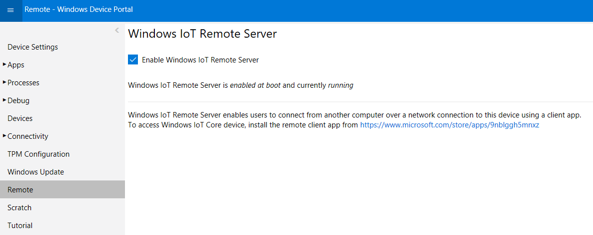
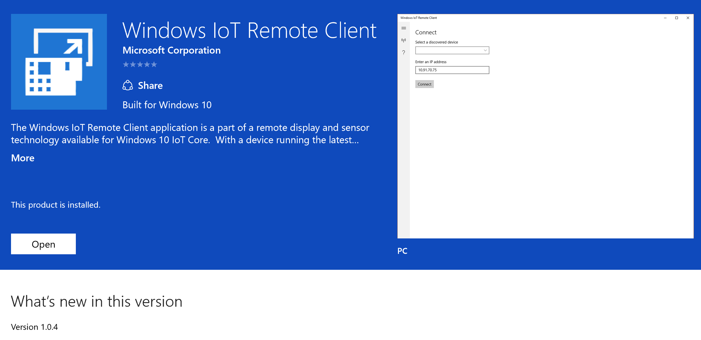
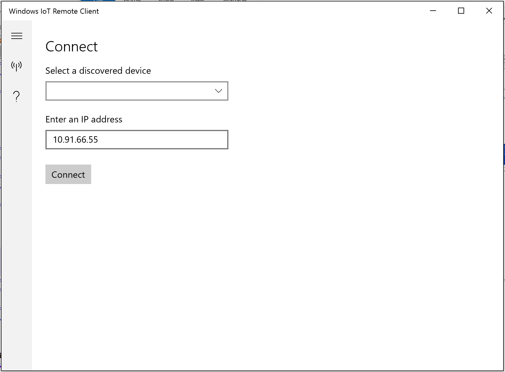

# Remote display
View and control your Windows 10 IoT Core UWP applications remotely, from a Windows 10 desktop PC, tablet, or phone

> [!WARNING]
> Windows IoT Remote Client is a developer only feature. It is not intended or supported for production devices.

> [!IMPORTANT]
> The Windows IoT Remote client does not work for Raspberry Pi. Use a board with accelerated graphics such as Minnowboard Max or Dragonboard or attach a monitor for local display.

## Overview
___
The remote display experience is a developer tool used to remotely control UWP applications running on a Windows 10 IoT Core device.   

## Setup
___
To get started, you'll need to set up a Windows 10 IoT Core device with the latest build of Windows 10 - visit the [Get Started](https://developer.microsoft.com/en-us/windows/iot/getstarted) page to set up your board.

Setup is quick and easy - follow the three steps below to use the remote display technology.

1. Ensure that your IoT Core device and development computer are on the same network and n a secure environment.

    One method is to connect your device directly to your laptop using a USB Ethernet adapter which supports automatic crossover.

1. Turn on the remote display functionality on your Windows 10 IoT Core device.
  
    Connect your device to the Internet and connect to Windows Device Portal.
  
	Choose the page "Remote" from the options on the left, and mark the check box labeled "Enable Window IoT Remote Server".  Your device is now enabled for remote display experience.
    

1. Install the Windows IoT Remote Client on your companion Windows 10 device.
  
    To enable a Windows 10 device to connect to your Windows 10 IoT Core device, you need to install our Store application.  The Windows IoT Remote Client app is currently available by link only and can be found [here](https://www.microsoft.com/en-us/store/apps/iot-remote-client/9nblggh5mnxz).
    
    


1. Connect to your Windows 10 IoT Core device through the installed application.
  
    Run the Windows IoT Remote Client application on your Windows 10 companion device.  At the Connect screen, enter the IP address of your device. The two devices should connect, remoting the UI experience of the Windows 10 IoT Core device to the companion device.
    
    You're now connected! From this point forward, touch and click input on the companion Windows 10 device can be used to control the Windows 10 IoT Core UWP application.  
    
      

## Compatibility and scope
___
In order to use the IoT Remote Client, you must be running the latest build of Windows 10 IoT Core on the target device and the latest client application from the store. 
    
  
## Troubleshooting
___
Using the remote display technology is quick and easy, but there are still some issues that users may experience.  Make sure to follow the Setup instructions above closely - if problems persist, check below.

### When I try to connect, the client app goes to a white screen.
Failed connections can be caused by a number of issues, but we've run into a couple more common problems:

1. Ensure that you are running the latest insider version of Windows 10 IoT Core and the IoT Remote Client application.
1. First, make sure your IoT device is on the same network as your companion device.
    Check that you're running the latest Insider build of Windows 10 IoT Core with the Windows IoT Remote Server enabled.
1. If this isn't the issue, try changing the resolution of your device to something we're guaranteed to support
    Follow the instructions in step 1 of the Setup section above to navigate to your device's web server.  Instead of selecting "Remote" from the menu on the left, stay on the "Home" page and scroll down to find resolution.  Try 800x600.
1. If this still doesn't fix your issue, you may have an issue that stems from never connecting your device to an external display.
    This will cause the device to think of itself as purely headless.  To fix this:
    * Eject the MicroSD Card, and put into your computer
    * Edit the `<MicroSD card drive>:\config.txt`
    * Add the following lines:
 
```
  hdmi_force_hotplug=1
  hdmi_group=2
  hdmi_mode=9
```
