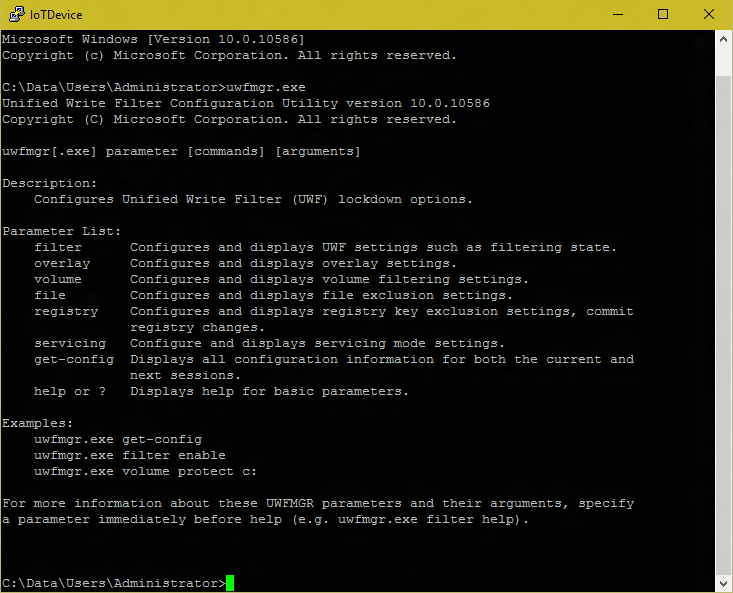
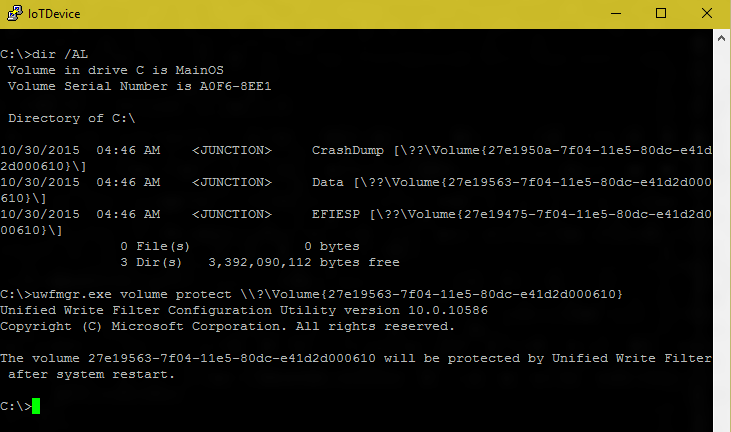

# Using the Unified Write Filter on Windows 10 IoT Core

The Unified Write Filter (UWF) is a feature to protect physical storage media from data writes. UWF intercepts all write attempts to a protected volume and redirects those write attempts to a virtual overlay. This improves the reliability and stability of your device and reduces the wear on write-sensitive media, such as flash memory media like solid-state drives.

Read [Unified Write Filter](https://msdn.microsoft.com/windows/hardware/mt572001) for more information.

If you do not have IoT Core Kits yet, Download and install [IoT Core Kits](https://www.microsoft.com/en-us/download/details.aspx?id=55031).

## How to Install UWF on a device running Windows 10 IoT Core
___
* Launch [Powershell](http://ms-iot.github.io/content/en-US/Docs/PowerShell) or [SSH](http://ms-iot.github.io/content/en-US/Docs/SSH) and access your device running Windows 10 IoT Core.
* From Powershell or SSH, do the following:
  * Create a temporary folder on the target machine (e.g. ```C:\UWFTemp```).
  * Based on your device architecture, copy UWF packages ( `Microsoft-IoTUAP-UnifiedWriteFilter-Package.cab` and `Microsoft-IoTUAP-UnifiedWriteFilter-Package_Lang_en-us.cab` ) from your PC (`C:\Program Files (x86)\Windows Kits\10\MSPackages\Retail\<arch>\fre\`) to `C:\UWFTemp`.
  * Run these commands to install the packages to your IoT device system image:
    * `applyupdate –stage C:\UWFTemp\Microsoft-IoTUAP-UnifiedWriteFilter-Package.cab`
    * `applyupdate –stage C:\UWFTemp\Microsoft-IoTUAP-UnifiedWriteFilter-Package_Lang_en-us.cab`
    * `applyupdate –commit`
* The device will boot to the Update OS, install UWF features, and reboot to the MainOS.
* Once the device comes back to the MainOS, the UWF feature is ready and available to use. This can be verified by typing ```uwfmgr.exe``` into your Powershell or SSH window.

  


## How to include UWF in Your Custom FFU 
___

* Add **IOT_UNIFIED_WRITE_FILTER** feature id to the OEM Input file 
* Create the image\FFU. Read [Create a basic image](https://msdn.microsoft.com/windows/hardware/commercialize/manufacture/iot/create-a-basic-image) for instructions.


## How to Use UWF
___

UWF can be configured using the uwfmgr.exe tool via a Powershell or SSH session.
Read [`uwfmgr.exe` tool](https://msdn.microsoft.com/windows/hardware/mt572002) for the available options with an exception of some commands listed below that are not supported in IoT Core.
Review the default settings of the Overlay configurations and adapt them per your requirements.

UWF can also be configured via MDM channel using [Unified Write Filter CSP](https://msdn.microsoft.com/library/windows/hardware/dn904976(v=vs.85).aspx).


* For example, the following combination of commands enable uwfmgr and configure to protect the C drive

  `uwfmgr.exe filter enable`      Enables the write filter
  <br>
  `uwfmgr.exe volume protect c:`  Protects the Volume C
  <br>
  `shutdown /r /t 0`              Restarts the device to make the write filter settings effective

*Reboot* is required to make all the uwfmgr settings effective. 


## Protecting a Data Volume
___

Data volume in IoT Core can be protected using the GUID for the volume. 
The GUID for the available volumes can be found through the following command

  `dir /AL`
  <br>
  `uwfmgr.exe volume protect \\?\Volume {GUID}`


  

### Recommended Exclusions
When protecting the data volume, we recommend that you add exceptions for the servicing and logging folders that are accessed by Windows OS Services.


C:\Data\Users\System\AppData\Local\UpdateStagingRoot
C:\Data\SharedData\DuShared
C:\Data\SystemData\temp
C:\Data\users\defaultaccount\appdata\local\temp
C:\Data\Programdata\softwaredistribution
C:\Data\systemdata\nonetwlogs


To add the exclusions:
  `uwfmgr.exe file Add-Exclusion <file/folder name>`
  
> [!WARNING]
> We recommend disabling Windows Update when enabling UWF. Enabling UWF without disabling Windows Update may result in system instability.

## Servicing UWF protected devices
___
The following steps are required to service UWF protected devices.

* `uwfmgr.exe filter disable` Disable UWF
* `shutdown /r /t 0` Reboot device to disable UWF
* Enable Servicing ( using provisioning package or MDM to set Update policy )
   * Note that the device will automatically reboot to perform the servicing updates
* `uwfmgr.exe filter enable` Enable UWF
* `shutdown /r /t 0` Reboot device to enable UWF

## Unsupported uwfmgr.exe Commands
___
**UWF Servicing Mode** is not supported in IoT Core.

`uwfmgr.exe` on Windows 10 IoT Core does not support commands listed below.

```
Filter 
    Shutdown 
    Restart 
Servicing 
    Enable 
    Disable 
    Update-Windows
```
